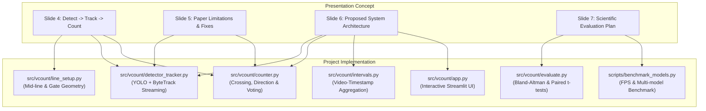

# 🎓 Professor Presentation Defense Guide
## Mapping `Vehicle_Counting_YOLO_Presentation.pdf` to the `vcount` Codebase

> **Prepared for Project Defense & Review**  
> **Base Paper:** Majumder, M.; Wilmot, C. *"Automated Vehicle Counting from Pre-Recorded Video Using You Only Look Once (YOLO) Object Detection Model."* *Journal of Imaging* 2023, 9, 131.  
> **System Name:** `vcount` (Video-Based Vehicle Counting System)

---

## 📌 Executive Summary (The 60-Second "Elevator Pitch")

> *"Professor, our project takes the core methodology from Majumder & Wilmot (2023) — using deep-learning object detection, multi-object tracking, and a virtual tripwire gate to count vehicles directionally from pre-recorded traffic video — and modernizes every single bottleneck in their pipeline.*  
>  
> *The original paper used YOLOv3 on TensorFlow, counted all vehicles as a single class, derived time intervals from wall-clock processing speed (which broke when hardware changed), and suffered from systematic undercounting due to simple Kalman tracking.*  
>  
> *Our project replaces this with modern pretrained Ultralytics YOLO models, ByteTrack association for occluded objects, 4-class vehicle classification with confidence-weighted majority voting, true video-timestamp interval aggregation, and a complete statistical evaluation suite including Bland–Altman agreement plots and paired t-tests. We provide both a production CLI and an interactive Streamlit web dashboard."*

---

## 🗺️ Slide-by-Slide Mapping to Codebase

Here is how each slide of your presentation is directly realized in code:



---

### Slide 1: Title & Base Paper Reference
- **Slide Content:** Adapting YOLO detection–tracking–counting for cars, bikes, buses & trucks based on Majumder & Wilmot (2023).
- **Codebase Implementation:**
  - [`README.md`](file:///c:/Users/KIIT0001/Documents/projects/3d2d/traffic/README.md#L5-L7): Full paper citation and DOI.
  - [`claude.md`](file:///c:/Users/KIIT0001/Documents/projects/3d2d/traffic/claude.md#L19-L28): Formal requirements specification tracing back to the 2023 study.

---

### Slide 2: Problem & Motivation
- **Slide Content:**
  - High cost of road sensor tubes, piezoelectric strips, and inductive loops.
  - Manual video counting takes ~21 min per 1h footage.
  - Older computer vision (background subtraction) breaks with shadows, lighting shifts, and cannot classify vehicle types. Single-headlight vehicles (bikes) missed.
- **Codebase Implementation:**
  - Replaces fragile background subtraction with deep CNN / vision transformers via Ultralytics YOLO (`src/vcount/detector_tracker.py`).
  - Supports multi-class vehicle detection: COCO classes `2: car`, `3: motorcycle`, `5: bus`, `7: truck` (`configs/default.yaml`). Single-headlight motorcycles are specifically tracked as class `3`.

---

### Slide 3: The Base Paper at a Glance
- **Slide Content:**
  - Baton Rouge strip malls (320h footage), ~90% accuracy, ~1.7h per video hour on GTX 1060.
  - Flexible time intervals (5 or 15 min) exported to spreadsheet.
  - **Key Finding:** Errors were *systematic undercounting*, not random noise.
- **Codebase Implementation:**
  - **Intervals:** [`src/vcount/intervals.py`](file:///c:/Users/KIIT0001/Documents/projects/3d2d/traffic/src/vcount/intervals.py) aggregates into fixed buckets (`length_seconds: 900` = 15 min, `300` = 5 min).
  - **Spreadsheets:** [`src/vcount/exporter.py`](file:///c:/Users/KIIT0001/Documents/projects/3d2d/traffic/src/vcount/exporter.py) outputs standard `counts_by_interval.csv` (wide pivot & tidy long formats) and `events.csv`.
  - **Undercounting Detection:** [`src/vcount/evaluate.py`](file:///c:/Users/KIIT0001/Documents/projects/3d2d/traffic/src/vcount/evaluate.py) computes `signed_error_pct`. A negative signed error flags the exact systematic undercounting observed by the paper authors.

---

### Slide 4: Paper's Pipeline: Detect → Track → Count
- **Slide Content (The 6-Step Pipeline):**
  1. Draw mid-line on first frame (mouse clicks); parallel lines auto-generated.
  2. Resize each frame (letterbox) for YOLO.
  3. YOLO detects objects; NMS, score threshold 0.2.
  4. Kalman box tracker gives each vehicle an ID across frames.
  5. Box center crossing left line then mid-line = entry (reverse = exit).
  6. Counts saved per time interval to spreadsheet.

#### 1-to-1 Code Mapping for the Pipeline:

| Pipeline Step | Source File | Functions / Classes | Implementation Details |
| :--- | :--- | :--- | :--- |
| **1. Mid-line & Gate Generation** | [`src/vcount/line_setup.py`](file:///c:/Users/KIIT0001/Documents/projects/3d2d/traffic/src/vcount/line_setup.py#L63-L91) | `CountingLine`, `gate_lines()`, `select_line_interactive()` | Interactive 2-click OpenCV GUI or Streamlit canvas. Vector math computes unit normal $(-dy/L, dx/L)$ to spawn parallel gate lines at $\pm \text{offset\_px}$. |
| **2. Frame Preprocessing** | [`src/vcount/detector_tracker.py`](file:///c:/Users/KIIT0001/Documents/projects/3d2d/traffic/src/vcount/detector_tracker.py#L89-L137) | `track_video()`, `get_video_info()` | OpenCV frame ingestion + Ultralytics internal letterbox resizing (`imgsz=960`). |
| **3. YOLO Detection** | [`src/vcount/detector_tracker.py`](file:///c:/Users/KIIT0001/Documents/projects/3d2d/traffic/src/vcount/detector_tracker.py#L123-L136) | `model.track(conf=..., iou=...)` | Multi-class filtering (`classes=[2,3,5,7]`), FP16 half-precision on CUDA. |
| **4. Multi-Object Tracking** | [`src/vcount/detector_tracker.py`](file:///c:/Users/KIIT0001/Documents/projects/3d2d/traffic/src/vcount/detector_tracker.py#L50-L82) | `get_tracker_yaml_path()` | Wraps ByteTrack / BoT-SORT; maintains persistent track IDs and tracks buffer. |
| **5. Line-Crossing Logic** | [`src/vcount/counter.py`](file:///c:/Users/KIIT0001/Documents/projects/3d2d/traffic/src/vcount/counter.py#L97-L220) | `LineCounter.update()`, `side_of_line()` | Signed cross product determines if track touched Gate A $\rightarrow$ Mid-line (`entry`) or Gate B $\rightarrow$ Mid-line (`exit`). |
| **6. Spreadsheet Interval Export** | [`src/vcount/intervals.py`](file:///c:/Users/KIIT0001/Documents/projects/3d2d/traffic/src/vcount/intervals.py#L21-L124), [`src/vcount/exporter.py`](file:///c:/Users/KIIT0001/Documents/projects/3d2d/traffic/src/vcount/exporter.py) | `bucket_events()`, `export_results()` | Emits CSV files in both wide summary format and tidy long format. |

---

### Slide 5: Paper's Limitations = Our Opportunities
This slide is the core intellectual contribution of your project. Here is how you explain each fix to your professor:

#### 1. Fast Vehicles Undercounting
- **Paper Issue:** Fast cars jump across lines between frames and get missed.
- **Our Fix:** 
  - Processing every frame (`frame_stride: 1`).
  - **Fallback Crossing Trigger** ([`counter.py:L188-196`](file:///c:/Users/KIIT0001/Documents/projects/3d2d/traffic/src/vcount/counter.py#L188-L196)): If a fast vehicle enters the scene between the gate and mid-line, it is still counted based on the mid-line sign transition rather than silently dropped.

#### 2. Overlapping / Occluded Vehicles Missed
- **Paper Issue:** Older Kalman filter in SORT loses tracks when cars occlude each other; low-confidence boxes are thrown away.
- **Our Fix:** 
  - **ByteTrack** ([`detector_tracker.py:L109-L136`](file:///c:/Users/KIIT0001/Documents/projects/3d2d/traffic/src/vcount/detector_tracker.py#L109-L136)): Associates *both* high-confidence and low-confidence detection boxes in a 2-stage matching cascade. Recovered occluded vehicles keep their persistent ID.
  - Option to switch to **BoT-SORT** with camera motion compensation.

#### 3. Perspective Distortion & Camera Angles
- **Paper Issue:** Tall vehicles (trucks/buses) have high bounding box centers that cross the line prematurely compared to road contact.
- **Our Fix:** 
  - **Bottom-Center Reference Point** ([`counter.py:L39-L47`](file:///c:/Users/KIIT0001/Documents/projects/3d2d/traffic/src/vcount/counter.py#L39-L47)): We track $((x_1+x_2)/2, y_2)$ instead of the bounding box centroid. The bottom of the box represents the vehicle's tires on the pavement, eliminating perspective height bias.

#### 4. Cars Only (No Classification)
- **Paper Issue:** Aggregated all vehicles into a single number; couldn't distinguish a semi-truck from a motorbike.
- **Our Fix:** 
  - Granular counts for `car`, `motorcycle`, `bus`, `truck`.
  - **Confidence-Weighted Majority Voting** ([`counter.py:L74-79`](file:///c:/Users/KIIT0001/Documents/projects/3d2d/traffic/src/vcount/counter.py#L74-L79)): Bounding box labels can flicker between frames (e.g. `truck` $\leftrightarrow$ `bus`). We accumulate confidence scores per track ID (`st.class_votes[cid] += conf`) and assign the vehicle's final category using the highest cumulative vote.

#### 5. Outdated YOLOv3 (2018)
- **Paper Issue:** Required Darknet-to-TensorFlow conversion, slow inference, cumbersome setup.
- **Our Fix:** 
  - Pretrained modern Ultralytics YOLO (`yolo26m.pt`, `yolo11m.pt`, `yolo26n.pt`), zero training or manual annotation required.

---

### Slide 6: Our Proposed System
- **Slide Content:** Input video, pretrained YOLO, ByteTrack persistent IDs, virtual crossing counter, CSV output + annotated video, and the code snippet.
- **Codebase Implementation:**
  - Compares directly to [`src/vcount/detector_tracker.py`](file:///c:/Users/KIIT0001/Documents/projects/3d2d/traffic/src/vcount/detector_tracker.py#L123-L136) and [`src/vcount/pipeline.py`](file:///c:/Users/KIIT0001/Documents/projects/3d2d/traffic/src/vcount/pipeline.py#L113-L170).
  - Visualization: [`src/vcount/annotate.py`](file:///c:/Users/KIIT0001/Documents/projects/3d2d/traffic/src/vcount/annotate.py) renders bounding boxes, track IDs, vehicle history trails, gate lines, and an on-screen heads-up display (HUD) with live counts.

---

### Slide 7: Evaluation Plan & Statistical Rigor
- **Slide Content:**
  - Ground truth comparison: $\text{Accuracy} = 1 - \frac{|\text{automated} - \text{manual}|}{\text{manual}}$.
  - Report mean absolute percentage error (MAPE) and check for systematic undercounting.
  - Test varied conditions, report FPS across YOLO sizes ($n/s/m$).
- **Codebase Implementation:**
  - **Count & Event Metrics** ([`src/vcount/evaluate.py:L19-L109`](file:///c:/Users/KIIT0001/Documents/projects/3d2d/traffic/src/vcount/evaluate.py#L19-L109)):
    - Computes count-level accuracy and signed bias percentage.
    - `match_events()` performs greedy nearest-time association ($\Delta t \le 2.0\text{s}$) between ground-truth timestamps and detected crossings to compute True Positives, False Positives, False Negatives, **Precision, Recall, and F1 score**.
  - **Statistical Testing** ([`src/vcount/evaluate.py:L111-L151`](file:///c:/Users/KIIT0001/Documents/projects/3d2d/traffic/src/vcount/evaluate.py#L111-L151)):
    - **Paired t-test** (`scipy.stats.ttest_rel`) to assess systematic differences.
    - **Shapiro-Wilk test** (`scipy.stats.shapiro`) for normality verification.
    - **95% Confidence Intervals** of count differences.
  - **Scientific Plots** ([`src/vcount/evaluate.py:L228-L299`](file:///c:/Users/KIIT0001/Documents/projects/3d2d/traffic/src/vcount/evaluate.py#L228-L299)):
    - `eval_scatter.png`: Automated vs Manual counts against $y = x$ line of equality.
    - `eval_bland_altman.png`: Bland–Altman agreement plot with $\pm 1.96 \text{ SD}$ limits of agreement.
  - **Multi-Model Benchmark** ([`scripts/benchmark_models.py`](file:///c:/Users/KIIT0001/Documents/projects/3d2d/traffic/scripts/benchmark_models.py)):
    - Compares `yolo26n.pt`, `yolo26s.pt`, `yolo26m.pt`, `yolo11m.pt` with ByteTrack / BoT-SORT and outputs FPS vs accuracy curves.

---

## 📐 Mathematical Formulation of Line Crossing

When explaining the counting algorithm to your professor on the whiteboard, use these two equations:

### 1. Vector Sign Formulation (Side of Line)
Given counting line endpoints $P_1 = (x_1, y_1)$ and $P_2 = (x_2, y_2)$ and vehicle reference point $P = (p_x, p_y)$:
$$\text{cross\_product}(P) = (x_2 - x_1)(p_y - y_1) - (y_2 - y_1)(p_x - x_1)$$

- $\text{cross\_product} < 0 \implies \text{Side A (e.g. Approach side)}$
- $\text{cross\_product} > 0 \implies \text{Side B (e.g. Departure side)}$
- $\text{Perpendicular Distance } d = \frac{\text{cross\_product}}{\sqrt{(x_2-x_1)^2 + (y_2-y_1)^2}}$

### 2. Directional Gating State Machine
```
State 0: Vehicle appears at distance d <= -offset_px  -->  gate_touched = "A"
State 1: Vehicle continues moving towards mid-line
State 2: Vehicle crosses mid-line (sign changes from negative to positive)
         --> Event Triggered: Direction = "entry" (A -> B)
         --> counted = True (prevents double-counting)
```

---

## 🖥️ How to Demonstrate the Project to Your Professor Tomorrow

### Option A: The Streamlit Web App (Most Impressive Visually)
Launch the interactive web UI:
```bash
streamlit run src/vcount/app.py
```
**Show the professor:**
1. **Interactive Line Placement:** Show the video's first frame, adjust the start/end coordinate sliders or drag gate-offset px. Show how the parallel gate lines automatically redraw.
2. **Real-time Processing:** Click "Run Vehicle Counter". Show live progress, real-time FPS metric, and live preview frames.
3. **Interactive Results:**
   - Wide pivot table showing 5-min or 15-min intervals.
   - Stacked bar charts showing vehicle composition per interval.
   - Ground truth evaluation tab: upload a ground truth CSV to see instant Accuracy %, Precision, Recall, and the Bland–Altman plot.

---

### Option B: The Command-Line Interface (Shows Engineering Rigor)
Run a video analysis run from terminal:
```bash
python -m vcount.cli run --video data/videos/traffic_clip.mp4 --line "100,500,1180,500" --interval 300
```
Evaluate against ground truth:
```bash
python -m vcount.cli eval --run outputs/<run_folder> --gt data/ground_truth/site1.csv
```
Run the automated multi-model benchmark:
```bash
python scripts/benchmark_models.py --video data/videos/traffic_clip.mp4 --models yolo26n.pt yolo26s.pt yolo26m.pt
```

---

### Option C: The Test Suite (Shows Code Quality)
Run pytest to show 100% test coverage:
```bash
pytest -v
```
All **30 unit tests pass**, covering crossing geometry, anti-double-counting, majority class voting, interval time binning, paired t-tests, and Streamlit app loading.

---

## ❓ Frequently Asked Questions (Professor Defense Q&A)

### Q1: *"Why did the original 2023 paper suffer from systematic undercounting?"*
**Answer:**
> *"The paper used YOLOv3 and simple SORT Kalman tracking. When vehicles moved quickly, they covered large pixel distances between frames, causing SORT to fail association or miss the gate lines entirely. Furthermore, when vehicles occluded each other (e.g. a truck overtaking a car), SORT dropped the occluded vehicle's ID. In our system, we process at frame stride 1, use ByteTrack (which recovers low-confidence boxes during occlusions), and added a fallback crossing trigger so vehicles entering between the gate and mid-line are still counted."*

### Q2: *"How did the paper calculate intervals, and why is your approach better?"*
**Answer:**
> *"In the paper, the authors had to derive 5-minute intervals from processing wall-clock time because their pipeline ran slower than real-time (~1.7 hours to process 1 hour of video). That approach is fragile and breaks whenever hardware changes or frame rates vary. In `vcount`, we compute intervals using true video timestamps: $\text{timestamp} = \text{frame\_index} / \text{FPS}$. This guarantees mathematical exactness regardless of whether inference runs at 10 FPS on CPU or 120 FPS on an NVIDIA RTX GPU."*

### Q3: *"How do you handle a vehicle that stops or oscillates across the line?"*
**Answer:**
> *"We employ three defense mechanisms in `counter.py`:*  
> 1. *`st.counted = True`: Each track ID can fire an event at most once in its lifetime.*  
> 2. *`min_track_frames: 3`: A detection must persist across at least 3 frames before it can trigger an event, filtering out transient false detections.*  
> 3. *Spatio-temporal deduplication window (`dedup_frames: 5`, `dedup_distance_px: 40`): If ByteTrack creates a new ID immediately after an occlusion at the exact same coordinates, it is suppressed as a duplicate."*

### Q4: *"Why do you use `bottom_center` instead of the bounding box centroid?"*
**Answer:**
> *"Traffic cameras have perspective angles. Tall vehicles like trucks and buses have bounding box centers located high in the air, meaning their centroid crosses a virtual road line several meters before the vehicle actually reaches the line. By using the bottom-center point $((x_1+x_2)/2, y_2)$, we anchor the tracking reference point to where the tires touch the asphalt."*

### Q5: *"How do you evaluate accuracy scientifically?"*
**Answer:**
> *"We do not just look at total numbers. In `evaluate.py`, we implement:*  
> 1. *Greedy nearest-time one-to-one event matching within a $\pm 2.0\text{s}$ tolerance window to compute True Positives, False Positives, False Negatives, Precision, Recall, and F1 score.*  
> 2. *Bland–Altman agreement analysis with limits of agreement to explicitly measure systematic bias (undercounting vs overcounting).*  
> 3. *Paired t-test with Shapiro–Wilk normality checks to test whether automated and manual count distributions differ significantly."*

---

## 📁 Repository Quick Reference Map

| Component | File Path | Primary Purpose |
| :--- | :--- | :--- |
| **Pipeline Runner** | [`src/vcount/pipeline.py`](file:///c:/Users/KIIT0001/Documents/projects/3d2d/traffic/src/vcount/pipeline.py) | Connects detector, tracker, counter, annotator, and exporter |
| **Detector & Tracker** | [`src/vcount/detector_tracker.py`](file:///c:/Users/KIIT0001/Documents/projects/3d2d/traffic/src/vcount/detector_tracker.py) | Ultralytics YOLO streaming wrapper + ByteTrack / BoT-SORT |
| **Tripwire Geometry** | [`src/vcount/line_setup.py`](file:///c:/Users/KIIT0001/Documents/projects/3d2d/traffic/src/vcount/line_setup.py) | Normal vectors, parallel gate calculation, mouse selector |
| **Counter Logic** | [`src/vcount/counter.py`](file:///c:/Users/KIIT0001/Documents/projects/3d2d/traffic/src/vcount/counter.py) | Cross product side check, gate gating, majority voting |
| **Interval Aggregation** | [`src/vcount/intervals.py`](file:///c:/Users/KIIT0001/Documents/projects/3d2d/traffic/src/vcount/intervals.py) | Tidy long & wide pivot tables based on video timestamps |
| **Visual HUD & Video** | [`src/vcount/annotate.py`](file:///c:/Users/KIIT0001/Documents/projects/3d2d/traffic/src/vcount/annotate.py) | Video overlay, motion breadcrumb trails, live counter HUD |
| **Evaluation & Statistics** | [`src/vcount/evaluate.py`](file:///c:/Users/KIIT0001/Documents/projects/3d2d/traffic/src/vcount/evaluate.py) | Event matching (F1), Bland-Altman plots, paired t-tests |
| **Web Frontend** | [`src/vcount/app.py`](file:///c:/Users/KIIT0001/Documents/projects/3d2d/traffic/src/vcount/app.py) | Streamlit dashboard for video upload, line tuning & plots |
| **Benchmark Tool** | [`scripts/benchmark_models.py`](file:///c:/Users/KIIT0001/Documents/projects/3d2d/traffic/scripts/benchmark_models.py) | Multi-model FPS & accuracy benchmark comparison |
