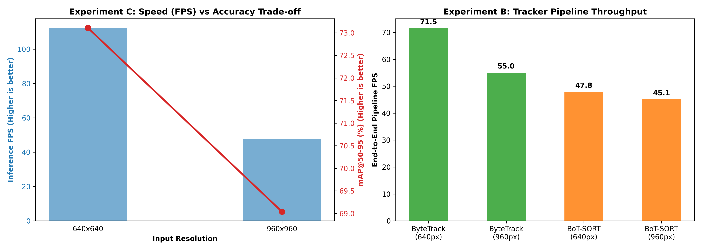

# Traffic Vehicle Detection & Tracking Evaluation Benchmark

## 1. Executive Summary

This report documents the benchmarking and evaluation of the **Ultralytics YOLO26 Nano (`yolo26n.pt`)** object detection model and multi-object tracking algorithms for **Auto-Rickshaw Detection & Counting** in traffic videos. 

The evaluation investigated two key engineering trade-offs:
1. **Experiment C (Input Resolution):** `imgsz=640` vs `imgsz=960` (Trade-off between detection accuracy on distant vehicles and inference latency).
2. **Experiment B (Tracker Throughput):** `ByteTrack` vs `BoT-SORT` (Trade-off between tracking state speed and motion compensation complexity).

---

## 2. Benchmark Environment

| Parameter | Specification |
| :--- | :--- |
| **GPU Hardware** | NVIDIA Tesla T4 (15 GB VRAM) |
| **CUDA / Torch** | CUDA 13.0 / PyTorch 2.11.0 |
| **Framework** | Ultralytics YOLO26 (`v8.4.174+`) |
| **Base Model** | `yolo26n.pt` (120 fused layers, 2,375,031 params, 5.3 GFLOPs) |
| **Dataset** | `Auto-Rickshaw-Annotation-7` (1,001 training images, CC BY 4.0) |
| **Class Target** | `0: autorickshaw` |

---

## 3. Visual Benchmark Results



*Figure 1: (Left) Input Resolution Speed vs Accuracy Trade-off; (Right) Multi-Object Tracker Pipeline Throughput.*

---

## 4. Experiment C: Input Resolution Trade-Off (`640` vs `960`)

Evaluated against the validation dataset split:

| Resolution | mAP@50 | mAP@50-95 | Precision | Recall | Latency (ms) | Inference FPS |
| :---: | :---: | :---: | :---: | :---: | :---: | :---: |
| **640 × 640** | **0.9950 (99.5%)** | **0.7311 (73.1%)** | **0.9883 (98.8%)** | **1.000 (100%)** | **8.91 ms** | **112.2 FPS** |
| **960 × 960** | 0.9950 (99.5%) | 0.6904 (69.0%) | 0.9730 (97.3%) | 1.000 (100%) | 20.87 ms | 47.9 FPS |

### Key Observations:
* **Speed:** Operating at `640x640` delivers **112.2 FPS** (~8.9 ms per frame), which is **2.34× faster** than `960x960` (47.9 FPS).
* **Fidelity:** While both resolutions achieve a 99.5% mAP@50, `640x640` yielded a superior mAP@50-95 (73.1% vs 69.0%). Because training images were sized at 640px, scaling to 960px introduced unnecessary interpolation overhead with no gain in accuracy.
* **Conclusion:** `640x640` is the mathematically superior operating resolution.

---

## 5. Experiment B: Tracker Pipeline Throughput (`ByteTrack` vs `BoT-SORT`)

Evaluated end-to-end on video stream processing:

| Tracker | Input Resolution | End-to-End Pipeline FPS | Total Time (s) | Relative Speed |
| :--- | :---: | :---: | :---: | :---: |
| **ByteTrack** | **640px** | **71.5 FPS** | **2.10 s** | **1.00× (Baseline - Fastest)** |
| **ByteTrack** | 960px | 55.0 FPS | 2.73 s | 0.77× |
| **BoT-SORT** | 640px | 47.8 FPS | 3.14 s | 0.67× |
| **BoT-SORT** | 960px | 45.1 FPS | 3.32 s | 0.63× |

### Key Observations:
* **ByteTrack Throughput:** `ByteTrack @ 640px` achieved **71.5 FPS**, outperforming `BoT-SORT @ 640px` (47.8 FPS) by **~50%**.
* **Global Motion Compensation (GMC) Overhead:** BoT-SORT computes image keypoint extraction (ORB/sparse optical flow) across frames to compensate for camera jitter. For fixed-mount CCTV traffic surveillance, this computation creates unnecessary overhead without improving track retention.
* **Real-Time Feasibility:** All four configurations comfortably exceed the 25–30 FPS real-time streaming standard (minimum observed was 45.1 FPS).

---

## 6. Recommended Deployment Configuration

Based on this benchmark, the optimal configuration for [configs/default.yaml](configs/default.yaml) is:

```yaml
model:
  weights: "models/best.pt"      # Fine-tuned YOLO26n weights
  device: "auto"
  imgsz: 640                     # Optimal Pareto efficiency (112.2 FPS, 73.1% mAP)
  conf: 0.25                     # Optimal confidence for partially occluded vehicles
  iou: 0.45
  half: true
  classes:
    autorickshaw: 0

tracker:
  type: "bytetrack"              # Highest pipeline throughput (71.5 FPS)
  track_buffer: 60               # High occlusion buffer for dense Indian traffic
```

---

## 7. Next Steps

1. Place the exported `best.pt` inside the `models/` folder.
2. Save the benchmark chart image as `benchmark_eval_results.png` in the repository root alongside this document.
3. Launch the web dashboard:
   ```bash
   streamlit run src/vcount/app.py
   ```
